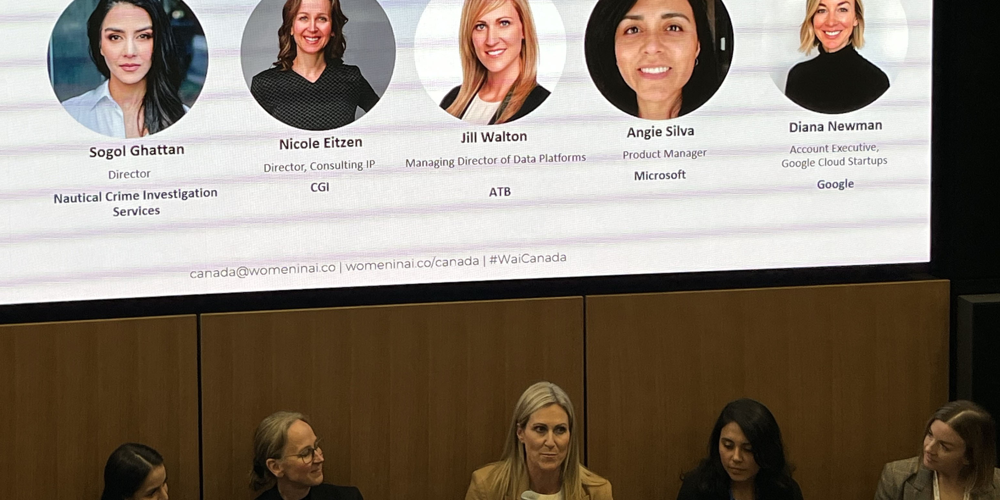

The in-person [Women in AI](https://www.womeninai.co/canada) Career Fair, held
in Calgary on November 7, 2024, in partnership with the Pacific Institute for
the Mathematical Sciences (PIMS) and our industry training program, Math to
Power Industry (M2PI), brought together a diverse group of professionals and
emerging talent in AI. The event featured nine industry panelists, including Dr.
Heather Vooys, who shared insights from her role as Machine Learning Lead at
AERIUM Analytics, and Dr. Sogol Ghattan, Director at Nautical Crime
Investigation Services (NCIS), who spoke on the ethical use of AI. Notably, Dr.
Vooys and Dr. Ghattan were M2PI mentors, underscoring M2PI's ongoing influence
in shaping future leaders in the field.

In her talk, Dr. Vooys highlighted that, in her work, she frequently encounters
problems that could be readily solved with mathematics, without the need for a
machine learning (ML) model. "I encouraged the audience to remember that AI and
ML are interdisciplinary tools," she said, "but if they’re the only tools in
your toolbox, you're likely missing other important methods." While AI and ML
can be highly useful, Heather pointed out that relying too heavily on them can
sometimes be inefficient. "Having a mathematics background has helped me
determine when ML is appropriate and when it might be excessive," she added,
"and it provides me with alternative methods to solve problems more
effectively."
  
M2PI supported rising talent through travel awards for Nazanin Hasheminejad and
Golnoush Farzanfard, enabling them to attend. Hiva Gheisari, an M2PI alum,
connected with professionals and secured a spot at the upcoming Women in AI X
Devfest YYC event, a coding competition to build career skills.
 
The career fair offered an inspiring environment for early-career professionals
and mid-level experts in AI, fostering a strong community focused on learning,
networking, and mentorship—demonstrating PIMS and M2PI’s commitment to enhancing
diversity and growth in mathematics and AI.
 
The 2025 PIMS M2PI training program, set to run from May 5 to 23, 2025, offers
graduate students and postdoctoral fellows in the mathematical sciences a unique
chance to gain specialized professional and technical skills. Participants will
work in teams on industry-specific challenges under the guidance of an industry
mentor. Applications open in January 2025. For updates, sign up for our
newsletter
[here](https://math.us8.list-manage.com/subscribe?u=c9cc3beec9fa57d7299ac161c&id=7c5a0fc17a).

