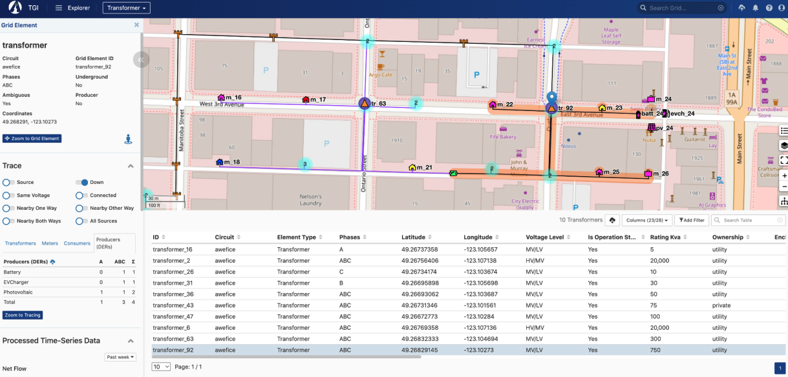

### Overview
At Awesense we've been building a platform for digital energy, with the goal of
allowing easy access to and use of electrical grid data in order to build a
myriad of applications and use cases for the decarbonized grid of the future,
which will need to include more and more distributed energy resources (DERs)
such as rooftop solar, batteries as well as electric vehicles (EVs).

Awesense has built a sandbox environment populated with synthetic but realistic
data and exposing APIs on top of which such applications can be built. As such,
what we are looking for is to create a collection of prototype applications
demonstrating the power of the platform. Given the synthetic nature of the
dataset we can make available, this would be more of a "deliver a method (and
implementation of it)" type project than a "deliver insights" type project.

This involves coding some analyses and visualizations on top of said data and
APIs. It would require good data wrangling + statistics + data visualization
skills to design and then implement the best way to transform, aggregate and
visualize the data for the use case at hand (see below). The data access APIs
are in SQL form, so SQL querying skills would also be required. Beyond that,
the tools and programming languages used to create the analyses and
visualizations would be up to the students. Typical ones we have used include
BI tools like Power BI or Tableau and notebooking applications like Jupyter or
Zeppelin combined with programming languages like python or R.

If the participants don't have any electrical background, we can teach enough
of it to allow handling the given use case. For this year's project, we have
chosen a use case entitled "EV charger capacity study". At a high level, this
entails determining how many new EV chargers could be installed in a particular
portion of the electrical distribution grid without overloading the capacity of
the grid infrastructure at that location. This would allow distribution grid
planners to determine whether or not to approve requests for "interconnection"
of EV chargers; it would also allow them to plan for needed infrastructure
upgrades to support more EV chargers in the future.

###  Details

Electrical distribution grids are composed of many circuits, in turn composed
of grid elements of various types (e.g. power lines, transformers, switches,
meters, SCADA devices, etc.) connected to each other in a network (graph)
structure.  Certain grid elements like meters, SCADA devices, fixed or movable
IoT sensors, and Distributed Energy Resources (DERs) produce time series data
such as voltage, current, power, energy, battery state of charge, and other
measurements.

Traditionally, electricity in the grid has flown from the "top" of circuits
(the substations connecting the distribution grid with the transmission grid)
"down" to "consumers" such as residences, businesses or industrial facilities.
With the addition of DERs such as solar, batteries and electric vehicles,
electricity flow can become bi-directional.

Each of the distribution grid elements have additional specific properties. For
instance, transformers have a certain "capacity" which dictates the maximum
electrical load that they can support at any given time. This, along with
existing load, restricts how many new EV chargers can be installed "downstream"
of a given transformer without causing it to "overload". Load is typically not
directly measured at the transformer, but at each of the consumer locations
downstream of it (often modeled via meters), therefore existing transformer
load needs to be aggregated from all these sources. Moreover, it is a dynamic
quantity, modeled as a time series. Thus, during so-called "peak periods" (when
load is high), there will be less room for additional EV charger load, whereas
during "off-peak periods" more EV chargers could be supported. For the given
use case, it will be necessary to answer the "how many new EV chargers could be
accommodated?" for both of these scenarios. A successful project will consist
of a set of visuals answering these questions for the sandbox dataset,
accompanied by any BI tool files or notebook code used to produce them;
Awesense permits/encourages the public sharing of these artifacts, as long as
credit for the dataset and APIs is given to Awesense (e.g. by including a
"Powered by Awesense" phrase and an Awesense website link); publishing the raw
data retrieved from the sandbox is not permitted.

In addition to the previously mentioned SQL APIs, the Awesense platform also
comes with a web-based application (graphical user interface front-end) called
TGI (True Grid Intelligence) that serves as a companion visual explorer for the
data stored in the platform. The snapshot below shows a portion of the grid
available in the synthetic dataset. A transformer is selected (map blue marker
and highlighted row in the table) and its properties shown in the left sidebar.
Additionally, the orange highlighting on the map shows a "down trace" from that
transformer and the trace table in the sidebar shows how many grid elements of
different types are part of that section of the grid. The SQL APIs include
functionality for retrieving this information programmatically, as well as for
retrieving the load time series associated with those elements.

For the duration of the project, upon agreeing to a standard end-user licensing
agreement, participants in this PIMS project will be given access to the
sandbox environment, including TGI, the programmatic SQL APIs and associated
documentation, as well as access to a GitHub repo with sample SQL and python
code snippets in Jupyter notebooks, showcasing how to use the APIs.

__Important note__: project participants will be given individual access
credentials and they should not share with anyone else (including not among
themselves), nor cache/save them in publicly posted files.
