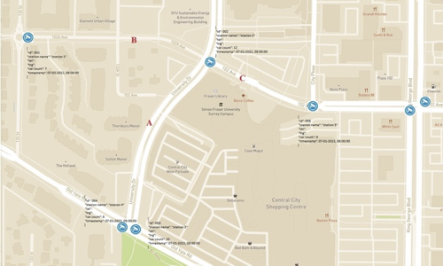

### Background 
A digital twin is a digital representation of a real-world entity or system,
according to Gartner . Data from physical world can be integrated into the
implementation of a digital twin and data from multiple digital twins can be
aggregated for a composite view across a number of real-world entities, such as
a city, and its related processes.

Typically, these digital imprints would be built on data sets that can be
filtered and processed by a number of sophisticated algorithms and computer
models. By linking and combining various urban data from models, analysis, and
simulation and by the implementation of social data collected from citizens,
the digital twin project would facilitate progressive social change in the
right direction. Furthermore, the visualization not only enables broad citizen
participation but also collaboration between stakeholders. The advantage of
using a virtual environment - such as large 3D display - is that different
participants with diverging professional and personal backgrounds can be
informed simultaneously. These technologies can enhance discussion and help
build consensus among stakeholders. In this context, urban digital twins and
visualization techniques are highly useful for positive social impacts. 

Cedar Academy Society is working towards completion of building a digital twin
of a Lower Mainland city, powered by Unity3D engine. During the summer of 2022,
we aim to complete the integration of real-time traffic data into such model to
better reflect the dynamic nature of the communities we live in. Through
previous studies, we have been able to associate traffic camera-captured images
to object counts. This year, we intend to drive further and to project those
object counts into visualized traffic in a virtual world.

Scientific and statistical questions involved therein can be challenging. Our
object counts are available at only discrete, if not sparse, geographical
locations and time stamps, while traffic in the digital twin is supposed to be
continuous and fluid in both geographical and time senses. Statistically sound
interpolation, or maybe innovative solution, will need to happen. The end
result of the project will "live" in our virtual world indefinitely, for
showcasing and further investigation.

### Problem Statement

Imagine you are trying to estimate the number of cars at a specific location on
a not-so-busy street. You do not have direct visual of the street or assistance
of traffic count-capturing tools, such as traffic conducting loop or traffic
camera, so direct observation is out of question. However, you know the number
of cars at an intersection 200 meters to the East. You also know the number of
cars at another intersection 300 meters to the West. Can you now have a
reasonable estimate of number of cars at your location? 

Now imagine somehow you have a reliable source of real-time vehicle counts at
400 locations in your city. Can you estimate the number of cars at any specific
spot on any road at any moment? If your solution is computationally intensive,
how can you optimize your solution to support real-time use cases? 

The following illustration may help visualize the estimation problem. Imagine
you are trying to estimate number of cars at location A, B, and C. You have
actual observations of vehicle counts at a few locations (marked by traffic
camera logos in the illustration) as ground truth. Assume you know the latitude
/ longitude of all relevant geographical locations on the map. Also assume all
traffics are “direction-less”. 

 

### Deliverables
1. Written explanation of an analytical or numerical solution to the Project
Problem. 
1. A working demo of solution with all or subset of the provided data, in a
programming language of choice, e.g., Python or Java 

If time allows, CAS would cooperate to integrate the solution to a Digital Twin
demo of a Canadian city, ideally City of Surrey, BC, to showcase some use cases
of real-time traffic estimation.

### Expected Student Skills
We are looking for young talents with problem solving skills, and curiosity to
experiment with new things. We are not looking for a particular solution, but
rather hope to recruit a team that will tackle this problem creatively using
all of their collective knowledge. 

### Data

Road geographical data
  * Data Delivery URL: (To be provided at first Team meeting)
  * Source: Digital Road Atlas (DRA) - Master Partially-Attributed Roads, BC Data
  * Source URL: https://catalogue.data.gov.bc.ca/dataset/digital-road-atlas-dra-master-partially-attributed-roads
  * Description: Digital Road Atlas Master Partially-Attributed Roads (DGTL ROAD ATLAS MPAR SP) provides partial information about roads in British Columbia. This data set represents the public data that is available for the Digital Road Atlas. Refer to this page (DATA DISTRIBUTION WORKFLOW FOR CONSUMERS) to select Surrey-specific Road (line) data from https://bcgov.github.io/data-publication/pages/dps_data_distribution_w.html
	Historical data provided to the Project Team: static GeoJSON data, containing attributes of all relevant public roads in the City of Surrey, with latitude / longitude information

Traffic Loops geographical and actual record data
  * Data Delivery URL: (To be provided at first Team meeting)
  * Source: Open Data at City of Surrey
  * Source URL: https://data.surrey.ca/dataset/traffic-loop-count
  * Description: Traffic conducting loop is generally considered to be an
effective way to provide a single source of ground truth for road traffic. The
web service provides the counts for each traffic loop in 15 minute intervals.
While the data is broken down by 15 minute intervals it is currently only
updated once per day. 
  * Historical data provided to the Project Team: (1) Daily data of Traffic
Loops Count data recorded at 15-min interval, Aug. 2021 - Jul. 2022 (2)
Latitude / longitude of all traffic conducting loops 

Traffic Cameras geographical and actual record data
  * Data Delivery URL: (To be provided at first Team meeting)
  * Source: Open Data at City of Surrey
  * Source URL: https://data.surrey.ca/dataset/traffic-cameras
  * Description: Traffic Camaras data at Surrey Open Data identifies the location of more than 360 major signalized intersections in the Surrey. Using the weblinks provided, you can see up-to-the minute traffic in the city.
  * Historical data provided to the Project Team: (1) Daily image snapshots taken by more than 360 traffic cameras at 15 min intervals, Aug. 2021 - Jul. 2022 (2) Latitude / longitude of all traffic cameras (3) Object counts detected (number of cars, trucks, pedestrians, bikes, e.g.) in all images by State-of-Art Computer Vision technology, at request.  
