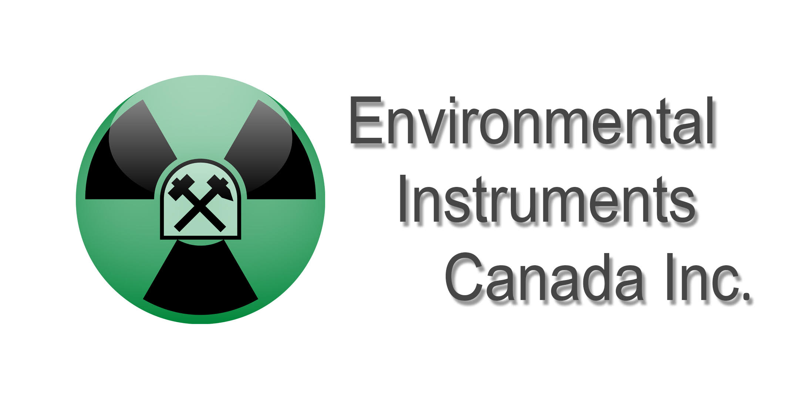
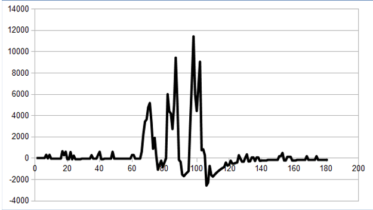
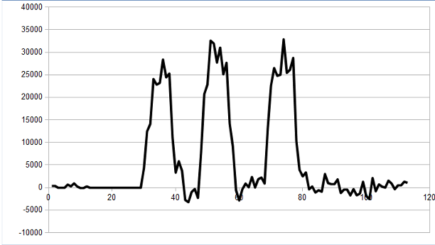

### Background
Residential radon progeny exposure is the second leading cause of lung cancer,
after smoking. The two main radon isotopes are Rn-222, which is part of the
uranium-238 decay chain, and Rn-220, also called thoron, which is part of the
thorium-232 decay chain. There is currently much interest in the Rn-220
contribution to radon progeny exposure, which has so far been largely ignored.
(Rn-220 has a relatively short half life and usually decays before it reaches
the living areas in a house and it usually doesn't show up in radon
measurements. But, Rn-220 has a longer lived decay product which does reach
living areas and contributes to radon progeny exposure. It can even exceed the
Rn-222 contribution.)

Environmental Instruments Canada (EIC) produces a Radon Sniffer (see
https://radonsniffer.com/ ), which is used by radon mitigators and building
scientists to find radon entry points. These sniffers currently assume all
radon is Rn-222. See the appendix for a more detailed description of how the
sniffer works. We want to extend the functionality to Rn-220. 

In a 2020 M2PI project, we came up with a dedicated sampling and counting
sequence and developed the math to determine how much Rn-222 vs Rn-220 was in
the air. This report is available to the team.

In this project, we wish to develop a method by which we can determine the
presence of Rn-220 in the air, while the Radon Sniffer is continually sampling
air and without having to run a dedicated thoron measurement sequence.

### Overview
The sniffer has a pump that draws in air. The air is filtered, only passing
radon (a noble gas) and filters radon progeny. The sniffer counts alpha
particles and can not distinguish between alpha particles from the decay of
Rn-222, Rn-220 or their progeny. During our normal radon sniffer algorithm, the
pump continually draws air through the instrument. When radon decays, its
progeny plates out inside the instrument and will decay at a later time. The
first count is assumed to be from Rn-222, which then decays and the progeny is
assumed to plate out inside the detector and decays again with an alpha
particle, which is counted with some probability at a later time. Our algorithm
calculates this expected background to be subtracted from future gross counts.
The net counts are then assumed to be from Rn-222 and the process repeats.

If our algorithm is correct and we expose the sniffer to a Rn-222 source and
subsequently to clean air, we expect the instrument to read close to 0, even
though it is still detecting alpha counts from the progeny that is plated out
inside.

The graph below shows the calculated radon concentration, in Bq/m3, after the
instrument was exposed to 3 bursts of mostly Rn-222 containing air, followed by
exposure to clean air. As expected, we see 3 peaks followed by recovery to 0,
when in clean air. There is some error (statistical and other), which accounts
for the graph bouncing around the 0 line.

The next graph shows the same with 3 exposures to Rn-220. The Rn-222 algorithm
doesn't work for Rn-220 and its progeny and the graph clearly goes below the 0
line. By recognizing when the calculated value goes below 0 (considering
errors) we can conclude that the prior exposure contained thoron and we can
reduce the future expected background accordingly.

### The Problem
We wish to develop an algorithm that continually checks if the calculated
radon concentration dips below 0. This could mean:

1. Our physics and math is wrong and we don't get as much Rn-222 progeny
plating out, from Rn-222 decay, as we thought.
1. There was thoron (Rn-220) in the air before and that produced counts but did
not produce progeny. (Again, that means our calculated [subtracted] amount of
progeny is too high.)
1. Counting statistics (i.e. there is randomness in the gross counts and there
is error in the calculated amount of progeny)

In the case of 1 and 2 we would simply reduce the amount of Rn-222 progeny that
we think is in the cell so that our result is no longer negative. That should
make subsequent calculations more accurate. If we think 2) was the case, we can
back calculate the amount of thoron that was previously present.

We need math skills to decide when we can rule out case 3) and to what extent.
Do you decide based on a 3 second counting interval, 15 second or a minute? The
sniffer doesn't know when it is in clean air. So, it has to continually run
this check and decide when a negative result,  above statistical noise, has
been encountered and how big the negative result was.
