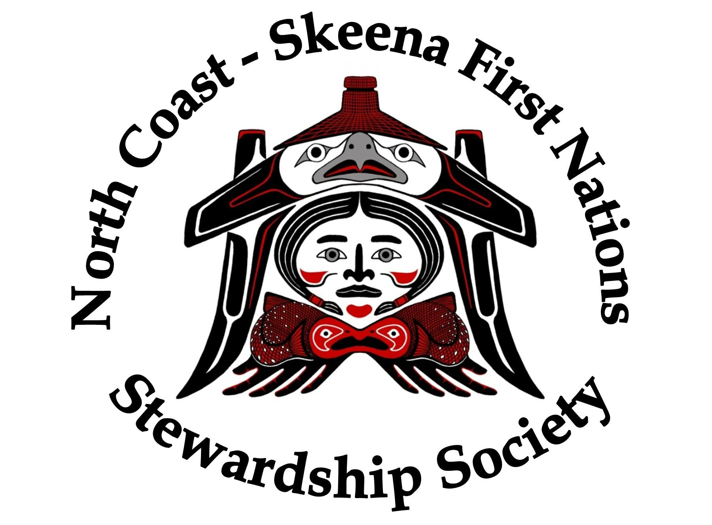

### Background

The North Coast Skeena First Nations Stewardship Society (NCSFNSS) is a
non-profit organization governed by a board composed of the elected Chiefs of
four Tsimshian communities, Gitxaala, Kitsumkalum, Kitselas and Gitga'at.  The
group has a collective geographical territory that spans the lower Skeena River
between Terrace and Prince Rupert, and the coastal marine area from the Nass
River Estuary (Chatham Sound) to Douglas Channel, near Kitimat.  In Fisheries
and Oceans Canada's management scheme, these marine areas are Pacific Fishery
Management Areas 3, 4, 5 and 6.  Chinook Salmon originating from the Skeena
River rear in the far North Pacific Ocean and return to their natal streams as
adults, migrating through the gauntlet of marine fisheries that are active in
PFMA's 3, 4 and 5.

The organization's work is primarily focussed on the conservation and
sustainable management of local and regional pacific salmon stocks
(populations), which requires the society's involvement in annual salmon stock
assessment activities, understanding of monitoring and assessment methods,
analytical approaches and application of results to management systems.  A key
objective of our conservation efforts is preserving the biological (genetic)
diversity in aggregate (large watershed) salmon populations.  A strategy
employed in pursuing this objective is monitoring the harvest impacts and stock
composition present in harvest of mixed stock (marine and lower watershed
freshwater) fisheries.  To this end, we have operated a seasonal recreational
fishery monitoring project (a creel survey) since 2015, which collects angler
interview data, harvest observations, vessel effort counts and biological
samples to produce effort and harvest estimates as well as a listing of
biological sample assignments to GSI (Genetic Stock Identification) stock
categories.  With harvest timing from interview data and associated GSI
information from bio-samples, management measures can be designed which
selectively mitigate harvest pressures on specific vulnerable wild Chinook
stocks and relative stock impacts from recreational harvest can be estimated.

NCSFNSS conducts random stratified sampling of anglers and their Chinook salmon
catch over a four month period (May 1 - August 31), annually.  Using CPUE
(catch-per-unit of effort) and estimates of vessel activity, total Chinook
harvest removals are estimated.  Chinook tissue samples are collected
opportunistically (as frequently as possible when Anglers are agreeable) from
Chinook salmon throughout the study period, which are processed to generate GSI
(genetic stock identification) information.  

Chinook harvest estimates contain multiple sources of error and GSI stock
assignments are based on probabilities given similarities between creel samples
and baseline DNA characteristics.  Our project pools data for monthly roll-up
and reporting, whereas sub-stock presence in fishery areas are known to vary on
a weekly basis.  Our study area is stratified into geographic sub-areas, however
sample sizes by subarea are not reliably large enough to produce estimates at
that resolution. 

The challenge is: determining the appropriate tissue sample size per week or
month required to effectively expand GSI data indicating proportionate stock
composition and apply it to the estimated harvest i.e produce meaningful stock
proportion estimates in the mixed stock recreational Chinook harvest for PFMAs 3
and 4.

### Data available

- historical GSI results based on Chinook microsatellite analysis from samples
  with dates and fishing areas provided
- biological sample collection records for each Chinook salmon sampled,
  including date and fishing area caught
- Chinook harvest estimates by month and area
- Effort estimates by month and area (supports harvest estimates)
- historical sampling program metrics in summary form

### Skills Required
- Completion of 3rd year statistics, ability to program in R and/or Python
- Fisheries Biology background or knowledge
- Have taken courses in Bayesian modelling and sampling program design
- Experience with team projects would be an asset
