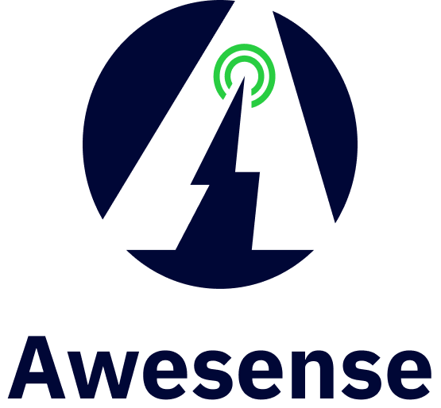
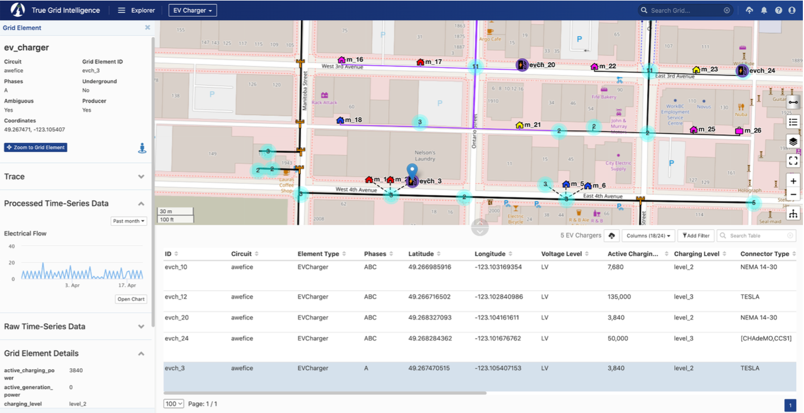

At [Awesense](https://www.awesense.com/), we’ve been building a platform for
digital energy with the goal of allowing easy access to and use of electrical
grid data in order to build a myriad of applications and use cases for the
decarbonized grid of the future, which will need to include more and more
distributed energy resources (DERs) such as rooftop solar, batteries as well as
electric vehicles (EVs) and still operate safely and efficiently.

Awesense has built a sandbox environment populated with synthetic but realistic
data and exposing APIs on top of which such applications can be built. As such,
what we are looking for is to create a collection of prototype applications
demonstrating the power of the platform.

_The current challenge involves building an application for optimizing the
distribution of load (consumption) across the grid so it is balanced instead of
overloaded in some areas and underloaded in others._

###  Background
In an electrical grid, power is distributed through multiple lines on three
different ‘phases’. Phases in an electrical grid are like lanes on a highway.
They allow for more efficient power delivery, especially for high-demand areas
like factories. Achieving ‘phase balance’ in a power grid is like keeping the
traffic evenly distributed across all lanes of the highway. If some lanes get
jammed while others are empty, it slows everything down. In the grid, unbalanced
phases can overload some power lines, leading to voltage drops and potential
equipment issues, just like a traffic jam creates delays and frustration for
drivers.

With the availability of data and use of analytics, it is possible to identify
which phases of the grid are more or less loaded and then to redistribute the
load across the three phases to ensure that the power flowing through each phase
is equal. Switching some loads from a heavily loaded phase to a less loaded one
can be done with a relatively low investment cost compared to upgrading the
conductors.

_The high-level aim of this project is to create an algorithm that identifies
the areas of the grid that are most unbalanced across phases and to identify
places where load can be easily switched from one phase to another in order to
optimize balance. The Awesense sandbox environment can be used for testing._

### Details
Electrical distribution grids are composed of grid elements of various types
(e.g. power lines, transformers, switches, meters, SCADA devices, etc.)
connected to each other in a network (graph) structure. Certain grid elements
like meters, SCADA devices, fixed or movable IoT sensors, and Distributed Energy
Resources (DERs) produce time series data such as voltage, current, power,
energy, battery state of charge, and other measurements.

In this project, the students will need to use the Awesense SQL or REST APIs to
retrieve the necessary time series and grid structure information to determine
and visualize which parts of the grid have the largest load imbalances and then
devise an algorithm that identifies the best places where load can be shifted
from one phase to another in order to optimize balance. Because load
(consumption) fluctuates over time, the problem has a temporal dimension that
needs to be taken into account, as the magnitude of load imbalance may vary with
time of day, week or year.

Additional information about the phase balance optimization use case can be
found
[here](https://www.awesense.com/ecosystem/phase-imbalance-correction-suggester-use-case/).

### Skillset
This work involves coding some analyses and visualizations on top of data and
APIs described above and devising an algorithm for redistribution of load to
optimize balance. It would require good data wrangling, statistics and data
visualization skills to design and then implement the best way to transform,
aggregate and visualize the data, and good mathematical / algorithmic skills for
the optimization piece. The data access APIs are in SQL form, so SQL querying
skills would also be required. Alternatively, REST APIs can be made available.
Beyond that, the tools and programming languages used to create the analyses,
visualizations and algorithms would be up to the students. Typical ones we have
used include BI tools like Power BI or Tableau and notebooking applications like
Jupyter or Zeppelin combined with programming languages like python or R.

### Tool Access and Support
If the participants don’t have any electrical background, Awesense will teach
enough of it to allow handling the given use case.

In addition to the previously mentioned SQL and REST APIs, the Awesense platform
also comes with a web-based application (graphical user interface front-end)
called TGI (True Grid Intelligence) that serves as a companion visual explorer
for the data stored in the platform. The snapshot below shows a portion of the
grid available in the synthetic dataset. An EV Charger is selected (map blue
marker and highlighted row in the table) and its properties shown in the
left sidebar, along with an electrical flow time series chart. The SQL &
REST APIs include functionality for retrieving all this information
programmatically.

For the duration of the project, upon agreeing to a standard end-user licensing
agreement, participants in this PIMS project will be given access to the sandbox
environment, including TGI, the programmatic SQL or REST APIs and associated
documentation, as well as access to a GitHub repo with sample SQL, REST and
python code snippets in Jupyter notebooks, showcasing how to use the APIs.

A successful project will consist of an algorithm and a set of visuals answering
the questions posed above for the sandbox dataset, accompanied by any BI tool
files or notebook code used to produce them; Awesense permits and encourages the
public sharing of these artifacts, as long as credit for the dataset and APIs is
given to Awesense (e.g. by including a "Powered by Awesense" phrase and an
[Awesense website link](https://awesense.com/)); publishing the raw data
retrieved from the sandbox is not permitted.

_**Important note**: project participants will be given individual access
credentials, and they should not share with anyone else (including not among
themselves) nor cache/save them in publicly posted files._
