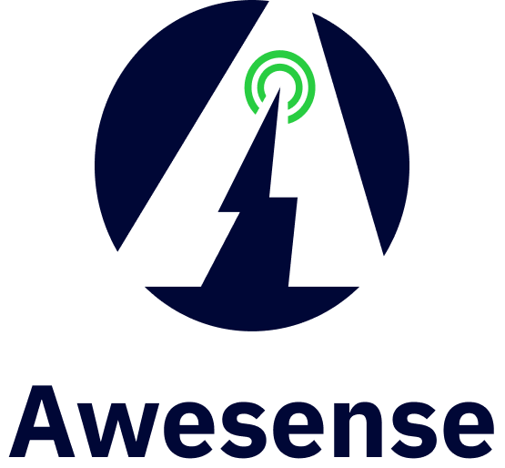
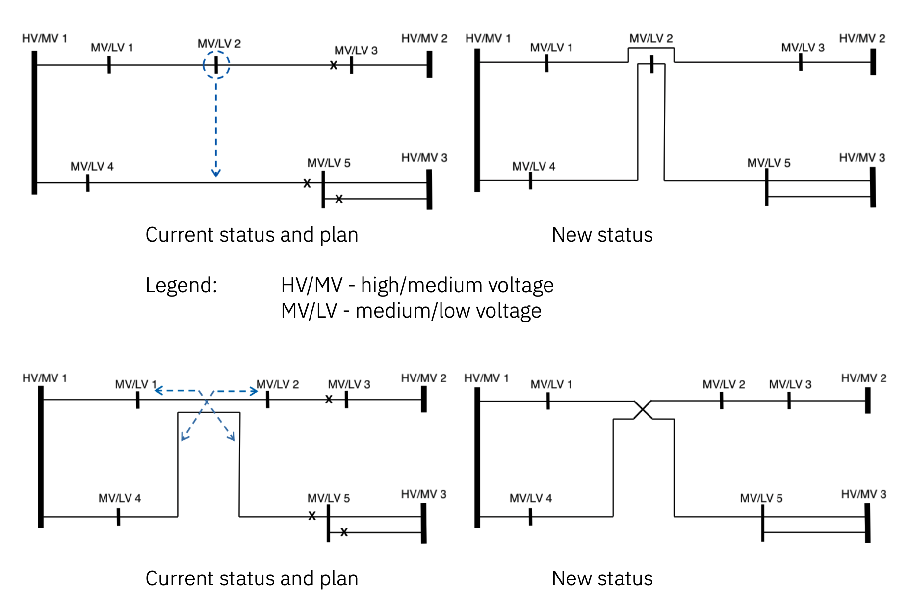
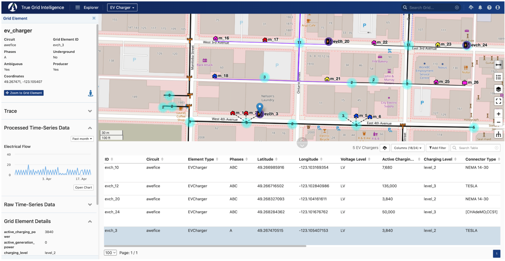

At Awesense, we’ve been building a platform for power grid digital twins with
the goal of allowing easy access to and use of electrical grid data in order to
build a myriad of applications and use cases for the decarbonized grid of the
future, which will need to include more and more distributed energy resources
(DERs) such as rooftop solar, batteries as well as electric vehicles (EVs) and
still operate safely and efficiently.

Awesense has built a sandbox environment populated with synthetic but realistic
data and exposing APIs on top of which such applications can be built. As such,
what we are looking for is to create a collection of prototype applications
demonstrating the power of the platform.

_The current challenge involves building an application for optimizing the
distribution of load (consumption) across the grid so it is balanced instead of
overloaded in some areas and underloaded in others._

###  Background

The ongoing shift from carbon-heavy energy sources to electrical power has led
to significant constraints on the capacity of the existing power distribution
infrastructure, particularly at the medium-voltage (MV) level. As demands for
electric power grow and previously small single-digit megawatt loads evolve into
tens of megawatts, the strain on existing conductor lines, transformers, and
HV/MV substations increases. Reinforcing or expanding infrastructure is both
costly and time-consuming, and utilities must look for faster and more
cost-effective ways to adapt to this new energy landscape.

Against this backdrop, the fundamental problem is to ensure that the MV grid can
handle higher power demands without exceeding capacity limits. With more
consumption points being connected and each demanding greater power, the grid
approaches its maximum permissible load. Utilities, therefore, need to find ways
to redistribute or reroute loads in order to alleviate tress on overloaded
segments, maintain reliability, and defer or avoid major infrastructure
upgrades.

Utilities can alleviate capacity constraints by selectively redistributing and
rerouting loads within the MV grid, often by adjusting or reassigning segments
of the grid among lines that have available capacity. Another option is to
strategically connect line segments at carefully chosen locations. This approach
can also involve taking advantage of overlapping conductor routes to form more
balanced feeders, effectively reducing the load on certain lines while
preventing overload conditions and thereby deferring costly infrastructure
expansions—all without compromising service reliability.

### Details
Electrical distribution grids are composed of grid elements of various types
(e.g. power lines, transformers, switches, meters, SCADA devices, etc.)
connected to each other in a network (graph) structure. A feeder is a set of
distribution lines (often operating at medium voltage) that collectively
transport power from a substation to a multitude of downstream loads. Certain
grid elements like meters, SCADA devices, fixed or movable IoT sensors, and
Distributed Energy Resources (DERs) produce time series data such as voltage,
current, power, energy, battery state of charge, and other measurements.

In this project, the students will need to use the Awesense SQL or REST APIs to
retrieve the necessary time series and grid structure information to determine
and visualize which parts of the grid are closest to capacity or in danger of
over-capacity should additional load be added, and then devise an algorithm that
identifies the best places where load can be shifted or swapped between feeders
in order to accommodate more overall capacity. Because load (consumption)
fluctuates over time, the problem has a temporal dimension that needs to be
taken into account, as the magnitude of available capacity may vary with the
time of day, week, or year.

Additional information about the grid capacity optimization use case can be
found
[here](https://www.awesense.com/ecosystem/mv-grid-optimization-analysis-use-case/).
The diagrams below show potential types of re-routes/swaps of lines.

### Skillset
This work involves coding some analyses and visualizations on top of the data
and APIs described above and devising an algorithm for the redistribution of
load to optimize overall capacity. It would require good data wrangling,
statistics and data visualization skills to design and then implement the best
way to transform, aggregate and visualize the data, and good
mathematical/algorithmic skills for the optimization piece. The data access APIs
are in SQL form, so SQL querying skills would also be required. Alternatively,
REST APIs can be made available. Beyond that, the tools and programming
languages used to create the analyses, visualizations and algorithms would be up
to the students. Typical ones we have used include BI tools like Power BI or
Tableau and notebooking applications like Jupyter or Zeppelin combined with
programming languages like Python or R.

### Tool Access and Support
If the participants don’t have any electrical background, Awesense will teach
enough of it to allow handling the given use case.

In addition to the previously mentioned SQL and REST APIs, the Awesense platform
also comes with a web-based application (graphical user interface front-end)
called TGI (True Grid Intelligence) that serves as a companion visual explorer
for the data stored in the platform. The snapshot below shows a portion of the
grid available in the synthetic dataset.  An EV Charger is selected (map
blue marker and highlighted row in the table) and its properties are shown
in the left sidebar, along with an electrical flow time series chart. The
SQL & REST APIs include functionality for retrieving all this information
programmatically.

For the duration of the project, upon agreeing to a standard end-user licensing
agreement, participants in this PIMS project will be given access to the sandbox
environment, including TGI, the programmatic SQL or REST APIs and associated
documentation, as well as access to a GitHub repository with sample SQL, REST
and python code snippets in Jupyter notebooks, showcasing how to use the APIs.

A successful project will consist of an algorithm and a set of visuals answering
the questions posed above for the sandbox dataset, accompanied by any BI tool
files or notebook code used to produce them; Awesense permits and encourages the
public sharing of these artifacts, as long as credit for the dataset and APIs is
given to Awesense (e.g. by including a “Powered by Awesense” phrase and an
[Awesense website link](https://awesense.com)); publishing the raw data
retrieved from the sandbox is not permitted.

_**Important note:** project participants will be given individual access
credentials, and they should not share with anyone else (including not among
themselves) nor cache/save them in publicly posted files._
