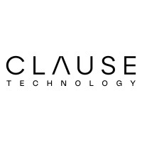

### Overview
The British Columbia Building Code (BCBC) is a long legalistic document
containing the provincial regulation that governs new construction, building
alterations, repairs, and demolitions, ensuring the highest standards of safety,
health, accessibility, fire, and structural protection of buildings, as well as
energy and water efficiency. Due to its length and wide range of scope, it is
not always easy for a builder engaged in a new construction or renovation to
locate the information they need to complete their project in the BCBC.

The goal of this project is to find a way to automate the process of finding relevant information in the BCBC.

Clause Technology is a software automation firm focusing on research and
development of software for clients across different industries. One of our
focuses is developing software tools to streamline tasks related to architecture
and civil engineering. One of our products involves a large language model (LLM)
powered chatbot which helps builders to find relevant sections of the BCBC using
a series of questions based on information about their construction projects.

### The Problem
The chatbot retrieves sections of the BCBC based on the answer to questions
provided by the user.  These questions involve a context or main topic, such as
the requirements for placing smoke detectors.  Retrieving the right information
is crucial for the efficiency and accuracy of the chatbot. This project aims to
develop strategies to chunk the BCBC and score the relevance of each part of the
code to find the most relevant chunks. In addition, due to the nature of the
legal document, finding all relevant chunks without missing anything is also
important.

A baseline approach for this problem is to have a fixed chunk size, categorize
the chunks and encode them as vectors, and compute cosine similarity of the
vectors to identify the most relevant chunks.  This is a standard technique used
to determine the relevance of a query.  However, this  is often not enough to
pinpoint the best results and deciding the cutoff score can be a challenge.  In
this project, we will pursue a more efficient and accurate approach.
