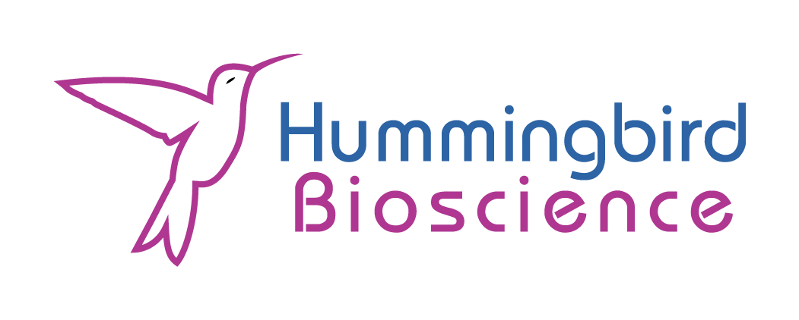

## Goal
Automated theorem proving was one of the major motivations for the development
of the field of computer science, but it is only recently becoming a reality.
The goal of this project is to advance our understanding of Rocq, a powerful and
evolving proof assistant.  In this project, we will perform an analysis of an
important library of “tactics” that Rocq uses to construct formal proofs.

### Background on Rocq
Rocq is a powerful and evolving proof assistant — a tool that helps
mathematicians and computer scientists write and verify precise definitions,
theorems, programs, and most importantly, formal proofs. Every proof written in
Rocq is checked by the computer at each step to ensure it’s logically sound.
Important difference from typical mathematical workflows: there can be no
handwaving. One may think of Rocq as a tool for structuring mathematics into
formal, analyzable objects.

When using Rocq, you’re working in a kind of interactive notebook — except
instead of just writing equations or pseudocode, you’re building living proofs
that evolve as you work. The process feels a lot like debugging: each lemma or
theorem starts as a “goal,” and your job is to apply steps — called tactics — to
simplify or transform that goal until it’s complete. Rocq tells you when the
proof is finished and guarantees that it’s valid.

For example:

  * Suppose your goal is to prove "for every positive number n, something
    holds."

  * A simple tactic like `intro`  will say: "Let’s assume  n is a positive
    number" and update the goal accordingly to be "something holds"

Tactics are the building blocks of interaction in Rocq. You can think of them as
operations or queries on a structured proof object. Many tactics are automated,
and you can also write your own — for example, a tactic that automatically tries
all valid algebraic rewrites until a desired equality is reached.

Because proofs in Rocq are constructed step-by-step and every step is explicit,
they can be extracted into executable programs. A proof that “every number has a
prime factorization” becomes a working program that computes the factorization.

Rocq has been used in large-scale math and computer science projects, such as:

  * The Four Color Theorem (fully formalized in Rocq).
  * The CompCert project (along with VST), which includes a fully verified C compiler — with a mathematical guarantee that the compiled code preserves the semantics of the original.

  * Formalizations of Homotopy Type Theory and other cutting-edge foundations.

The dataset as a graph of all the proof of all the things: When one starts to
really dig into Rocq development, one realizes that a large number of
developments have already been done in the standard libraries and it’s important
to reuse these developments, as formalization takes significantly longer than
one might expect.  There are dependencies of lemmas on past lemmas, specialized
proof techniques used in different sub-fields of the standard library (e.g.
analysis, number theory, algebra, etc).  The tactics used throughout the
standard library thus have non-trivial (graphical) relationships in terms of
their usage.  This project will work with a graph representation of all the
known proofs in the library, using a python API to browse the library through
the so called "Tactician API for Python".

Things that have not been explored: There are sort of two subprojects that arise
from treating the dataset of all known proofs in Rocq as a giant graph.

1. We will work with the team on this sub-project to perform various graph
   theoretic analyses.  One type of analysis is looking at certain subgraph
   similarities.  Another type will be looking at what percentage of the set of
   all known proofs can be reproduced but with highly restricted tactics.  There
   has been no deep statistical analysis of such properties, so any analysis
   done here will be extremely interesting!
2. The graph as a dynamical system — we will work with the team on this
   subproject to develop the graph of all proofs as dynamical system.  One can
   think of moving through the proofs, by applying tactics, as a trajectory
   through the space of proof state objects, which gives rise to some kind of
   graph dynamics.  We liken this to techniques used in strategy game analysis,
   e.g. AlphaZero, for applying analysis to e.g. Chess where moves are like
   tactics and the game state is like the proof state.  A crucial realization
   for chess is that it helps to identify ‘key’ moments in a game where the game
   comes alive.  We will work the team on this project to develop an
   analogous notion of “key proof steps”.  We are not aware of this being
   tried before, so there is some novelty here.

### Skills Needed
If these topics sound interesting or fun to you, but you’re worried that you
don’t have the background as a Rocq user or a formal methods person, that can be
okay.  Much of what we need to do here, can be done purely on the graphical
representation of proofs that you will use from the tactician API, which has a
python API, so only python programming is required.  Here are some other skills
that might help.
