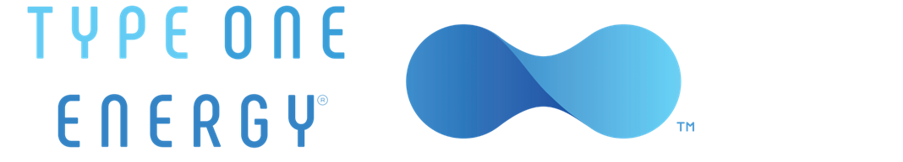

The purpose of this project is use compute numerical solutions to [Beltrami's
equation](https://en.wikipedia.org/wiki/Beltrami_equation) design and analyze
the performance of fusion reactors.  Magnetic fields in so-called Taylor relaxed
states satisfy Beltrami's equation and can be good models of magnetic fields in
confined plasma equilibria.

## About Type One Energy

At Type One Energy Group, we are developing optimized stellarator designs to
provide sustainable, affordable fusion power to the world. We apply proven
advanced manufacturing methods, modern computational physics and high-field
superconducting magnets to pursue the lowest-risk, shortest-schedule path to a
fusion power plant over the coming decade.

## The Problem

The purpose of the project is to expand the suite of numerical codes we rely on
to design and analyze the performance of our fusion reactors. Specifically, we
will explore a new framework for computing the magnetic steady states in our
reactors.

An efficient and predictive approach to describing the magnetic field of
stellarator steady states is to decompose the stellarator into subregions in
which the magnetic field is in Taylor relaxed states, satisfying Beltrami's
equation. We will therefore investigate the possibility of using an automated
framework for solving partial differential equations, such as
[Firedrake](https://www.firedrake.org) or
[FEniCS](https://fenicsproject.org), to compute Beltrami's equation in
three-dimensional toroidal geometries, and replace our existing legacy codes for
these applications.

For this project, we will provide the complete description of the partial
differential equation to be solved and the toroidal geometry we will work with.
We will also provide examples of solutions for the two-dimensional version of
the problem with the FEniCS framework. The participants will develop a method
for meshing the three-dimensional domain, for expressing the Beltrami
partial-differential equation in the desired format for the automated PDE
framework, and solve the problem in the three-dimensional toroidal geometry
of interest.

## Skillset

The project requires a good command of standard numpy tools and programming
practices in Python. It also requires a good understanding of elementary partial
differential equations (e.g. the first 4 chapters of [Evans' PDE
textbook](https://books.google.ca/books/about/Partial_Differential_Equations.html?id=Xnu0o_EJrCQC)) and a
good understanding of elementary numerical analysis / scientific computing. No
prior knowledge of fusion or plasma physics is required. We will be happy to
teach participants as much about fusion and plasma physics as they would like to
learn!

To make this project tractable, we will rely on Python-based automated
frameworks for solving partial differential equations, such as Firedrake or
FEniCS.
- [Firedrake](https://www.firedrakeproject.org/) or
- [FEniCS](https://fenicsproject.org/).
