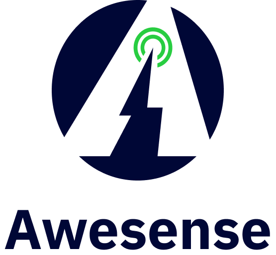
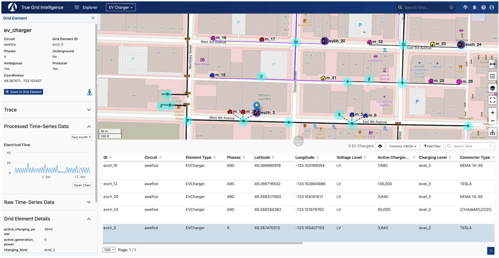

At [Awesense](https://www.awesense.com/), we've been building a platform for
power grid digital twins with the goal of allowing easy access to and use of
electrical grid data in order to build a myriad of applications and use cases
for the decarbonized grid of the future, which will need to include more and
more distributed energy resources (DERs) such as rooftop solar, batteries as
well as electric vehicles (EVs) and still operate safely and efficiently.

Awesense has built a sandbox environment populated with synthetic but realistic
data and exposing APIs on top of which such applications can be built. As such,
what we are looking for is to create a collection of prototype applications
demonstrating the power of the platform.

_The current challenge involves building computational techniques for
automatically detecting the presence of behind-the-meter electric vehicles and
disaggregating their consumption from the overall household (meter)
consumption._

### Background
Energy disaggregation, also known as appliance disaggregation is a technique
which is used to analyze and break down the energy consumption in a building or
household into individual appliance-level energy usages. The goal is to identify
and monitor the energy consumption of specific “appliances” without the need for
additional metering or sensors on each device.

The process of energy disaggregation involves analyzing the overall power signal
from a building or household and applying advanced algorithms and machine
learning techniques to separate and attribute energy consumption to specific
sources. One of these sources can be electric vehicles (EVs), particularly ones
plugged-in directly into regular outlets. These are the focus of the proposed
project.

The ability to perform energy disaggregation analytics holds significant
importance for utilities and electricity distribution. By gaining granular
insights into customers' energy usage at a more granular level, utilities can
develop targeted demand response programs, optimize load distribution, and
enhance grid management. Energy disaggregation analytics enables utilities to
identify peak demand periods, forecast load patterns, and make informed
decisions regarding infrastructure investments.

### Details
Electrical distribution grids are composed of grid elements of various types
(e.g. power lines, transformers, switches, meters, SCADA devices, etc.)
connected to each other in a network (graph) structure. A feeder is a set of
distribution lines (often operating at medium voltage) that collectively
transport power from a substation to a multitude of downstream loads. Certain
grid elements like meters, SCADA devices, fixed or movable IoT sensors, and
Distributed Energy Resources (DERs) produce time series data such as voltage,
current, power, energy, battery state of charge, and other measurements.

In this project, the students will need to use the Awesense SQL or REST APIs to
retrieve the necessary time series and grid structure information to determine
(and visualize) which households (meters) likely have an electric vehicle, at
what times is it plugged in and how much energy does it draw.

Additional information about the EV disaggregation use case can be found
[here](https://www.awesense.com/ecosystem/ev-appliance-disaggregation/).

### Skillset
This work involves coding some analyses and visualizations on top of the data
and APIs described above and devising an algorithm for the redistribution of
load to optimize overall capacity. It would require good data wrangling,
statistics and data visualization skills to design and then implement the best
way to transform, aggregate and visualize the data, and good
mathematical/algorithmic skills for the optimization piece. The data access APIs
are in SQL form, so SQL querying skills would also be desirable. Alternatively,
REST APIs can be made available. Beyond that, the tools and programming
languages used to create the analyses, visualizations and algorithms would be up
to the students. Typical ones we have used include BI tools like Power BI or
Tableau and notebooking applications like Jupyter or Zeppelin combined with
programming languages like Python or R.

### Tool Access and Support

If the participants don’t have any electrical background, Awesense will teach
enough of it to allow handling the given use case.

In addition to the previously mentioned SQL and REST APIs, the Awesense platform
also comes with a web-based application (graphical user interface front-end)
called TGI (True Grid Intelligence) that serves as a companion visual explorer
for the data stored in the platform. The snapshot below shows a portion of the
grid available in the synthetic dataset. An EV Charger is selected (map blue
marker and highlighted row in the table) and its properties are shown in the
left sidebar, along with an electrical flow time series chart. The SQL &
REST APIs include functionality for retrieving all this information
programmatically.

For the duration of the project, upon agreeing to a standard end-user licensing
agreement, participants in this PIMS project will be given access to the sandbox
environment, including TGI, the programmatic SQL and REST APIs and associated
documentation, as well as access to a GitHub repository with sample SQL, REST
and python code snippets in Jupyter notebooks, showcasing how to use the APIs.

A successful project will consist of an algorithm and a set of visuals answering
the questions posed above for the sandbox dataset, accompanied by any BI tool
files or notebook code used to produce them; Awesense permits and encourages the
public sharing of these artifacts, as long as credit for the dataset and APIs is
given to Awesense (e.g. by including a “Powered by Awesense” phrase and an
[Awesense website link](https://www.awesense.com); publishing the raw data
retrieved from the sandbox is not permitted.

_Important note : project participants will be given individual access
credentials, and they should not share with anyone else (including not among
themselves) nor cache/save them in publicly posted files._
