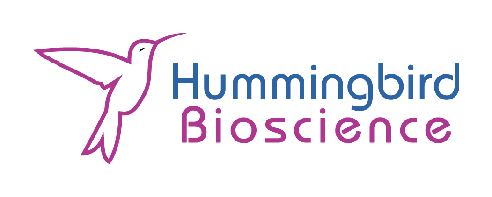

Recently, the quest for mathematical superintelligence has become a focal point in artificial intelligence. For example, Robinhood’s spinoff Harmonic has achieved a valuation exceeding $1 billion with its Aristotle tool. A key reason for this excitement is that mathematical reasoning is fundamentally different from other forms of reasoning: it is, by nature, airtight. It was believed that AI systems would struggle with this domain. However, recent advances suggest otherwise.

Modern systems are increasingly capable of translating between informal mathematical language (as written in papers) and formal representations suitable for proof assistants such as Lean, Rocq, or Agda. One striking example includes the recent overturning of a long-standing result in an extended quantum field theory, previously cited hundreds of times over more than a decade. However, these systems are demonstrating strong performance primarily on carefully selected, benchmark-style problems or carefully chosen problems. Their behavior outside of these settings remains poorly understood.

In particular, while they can often verify closed-form results in isolation, they often struggle to correctly represent and validate the dependencies those results rely on. This creates a critical reliability gap: outputs may appear correct locally while being globally inconsistent.

As an industry partner developing AI systems for mathematical reasoning, we are directly interested in understanding the limits of these auto-formalization tools. Without a systematic understanding of their failure modes, deploying such systems introduces substantial risk. This is made worse as organizations begin making significant financial and strategic decisions based on their outputs.

### Project Objective

This project will investigate the robustness of auto-formalization systems by
identifying and characterizing their failure modes. Teams will:

* Explore how current systems translate informal mathematics into formal
  representations
* Identify classes of problems where these systems perform well and where they
  fail
* Develop strategies—such as adversarial search or evolutionary (genetic)
  methods—to generate mathematical inputs that induce failure
* Analyze and categorize failure modes, with particular attention to dependency
  structure and logical consistency

### Deliverables

* Challenging mathematical statements on which tools struggle or fail
* A taxonomy of observed failure modes
* Quantitative or qualitative metrics for evaluating system robustness
* Bonus: Recommendations for improving reliability in auto-formalization systems

### Why This Matters

These systems can already produce convincing formal outputs. However, without
understanding when and how they fail—particularly in handling dependencies—their
use in research, verification, and high-stakes applications remains
fundamentally limited. This project aims to make this gap more visible.

### Teams may consider approaches such as:

* Restricting to a specific domain (e.g., algebraic identities, inequalities,
  combinatorics, measure theory, symplectic geometry, etc.)
* Designing perturbations of known theorems to test robustness
* Modeling the search space of candidate statements
* Using adversarial or evolutionary methods to discover failure cases

Further, we will assist teams in getting bootstrapped to experimentation with
both closed and open-source LLMs and auto-formalization tools, and help set up
tooling for advanced search methods such as adversarial or genetic approaches.
