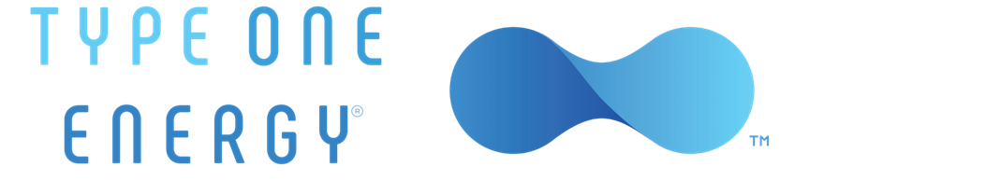

The purpose of this project is to identify, through numerical optimization,
fusion reactor shapes which maximize the average pressure of the fusion fuel.

### About Type One Energy
At Type One Energy Group, Inc., we are developing optimized stellarator designs
to provide sustainable, affordable fusion power to the world. We apply proven
advanced manufacturing methods, modern computational physics and high-field
superconducting magnets to pursue the lowest-risk, shortest-schedule path to a
fusion power plant over the coming decade.

### The Problem
The goal of the project is to determine, via the application of local, global,
and machine-learning based numerical optimization algorithms, the
cross-sectional shapes of fusion reactors which maximize the average pressure of
the fusion fuel. Since the average pressure is computed from the solution of a
partial differential equation (PDE) describing force balance for the fusion fuel
inside the reactor, this is a PDE constrained shape optimization problem.

The Type One Energy mentor will provide the complete description of the PDE to
be solved and of the toroidal geometry we will work with. They will also provide
Python examples of numerical solvers for the PDE of interest. The participants
will therefore focus their efforts on the development of optimization algorithms
for this shape optimization problem.

### Skillset
The project requires a good command of standard numpy tools and programming
practices in Python. It also requires a good understanding of elementary partial
differential equations (e.g. the first 4 chapters of [Evans’ PDE
textbook](https://books.google.ca/books/about/Partial_Differential_Equations.html?id=Xnu0o_EJrCQC))
and a good understanding of elementary numerical analysis / scientific
computing. No prior knowledge of fusion or plasma physics is required. We will
be happy to teach participants as much about fusion and plasma physics as they
would like to learn!

If we make good progress on this project, it may become valuable to become
familiar with Python-based automated frameworks for solving partial differential
equations, such as Firedrake or FEniCS.
